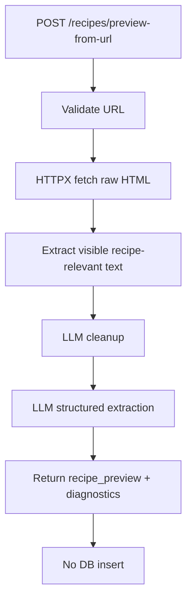

# ForkFolio API Reference

## OpenAPI Contract

- Standard: OpenAPI `3.1`
- OpenAPI JSON: `/openapi.json`
- Swagger UI: `/docs`
- ReDoc: `/redoc`

## Base URL

- Local: `http://localhost:8000`
- Production: `https://<your-service-domain>`
- API base path: `/api/v1`

## Authentication

ForkFolio supports two token styles for protected endpoints:

- `X-API-Token: <API_AUTH_TOKEN>`
- `Authorization: Bearer <API_AUTH_TOKEN>`

Public endpoints (no token required):

- `GET /api/v1/`
- `GET /api/v1/health`

## Common Error Responses

Error payload shape:

```json
{
  "detail": "Error message"
}
```

Common status codes:

- `401` Unauthorized (protected endpoints only)
- `413` Request payload too large
- `429` Rate limit exceeded (protected endpoints only, includes `Retry-After` header)
- `500` Internal server error
- `504` Request timeout
- `422` Request validation error (path/query/body validation)

## Health Endpoints

### `GET /api/v1/`

Auth: Public

Returns a basic API welcome payload.

Example response:

```json
{
  "message": "Welcome to ForkFolio API"
}
```

### `GET /api/v1/health`

Auth: Public

Returns lightweight liveness status.

Example response:

```json
{
  "status": "ok"
}
```

## Recipes Endpoints

### `POST /api/v1/recipes/process-and-store`

Auth: Required

Runs the ingestion pipeline for raw recipe input and stores the result.

Request body:

```json
{
  "raw_input": "Chocolate Chip Cookies\n\nIngredients:\n- 2 cups flour\n- 1 cup sugar\n\nInstructions:\n1. Mix\n2. Bake",
  "enforce_deduplication": true,
  "isTest": false
}
```

Field notes:

- `raw_input` (string, required, min length `10`)
- `enforce_deduplication` (boolean, optional, default `true`)
- `isTest` (boolean, optional, default `false`; `is_test` also accepted)

Success response (created):

```json
{
  "recipe_id": "uuid",
  "recipe": {},
  "success": true,
  "created": true,
  "message": "Recipe processed and stored successfully"
}
```

Success response (duplicate):

```json
{
  "recipe_id": "uuid",
  "recipe": {},
  "success": true,
  "created": false,
  "message": "Duplicate recipe found; returning existing recipe."
}
```

Pipeline error payload:

```json
{
  "error": "Error details",
  "success": false
}
```

### `POST /api/v1/recipes/preview-from-url`

Auth: Required

Fetches a recipe webpage URL, parses/extracts readable HTML content, runs the
cleanup + extraction pipeline, and returns a preview without inserting anything
into the database.

Request body:

```json
{
  "url": "https://example.com/chocolate-chip-cookies"
}
```

Field notes:

- `url` (string, required, valid `http` or `https` URL)

API contract:

- `success` (boolean): Whether preview extraction succeeded
- `created` (boolean): Always `false` for this endpoint (no DB write)
- `url` (string): Normalized source URL used for fetch
- `recipe_preview` (object, success only): Extracted recipe shape:
  - `title` (string)
  - `ingredients` (array of strings)
  - `instructions` (array of strings)
  - `servings` (string)
  - `total_time` (string)
- `diagnostics` (object): lengths captured during pipeline:
  - `raw_html_length` (integer)
  - `extracted_text_length` (integer)
  - `cleaned_text_length` (integer)
- `message` (string, success only)
- `error` (string, failure only)

Flow chart:



Success response:

```json
{
  "success": true,
  "created": false,
  "url": "https://www.example.com/chocolate-chip-cookies",
  "recipe_preview": {
    "title": "Chocolate Chip Cookies",
    "ingredients": [
      "2 cups all-purpose flour",
      "1 cup unsalted butter, softened",
      "3/4 cup granulated sugar",
      "3/4 cup brown sugar",
      "2 large eggs",
      "2 cups chocolate chips"
    ],
    "instructions": [
      "Preheat oven to 350F and line a baking sheet.",
      "Cream butter and sugars, then beat in eggs.",
      "Mix in flour and fold in chocolate chips.",
      "Scoop dough and bake 10 to 12 minutes."
    ],
    "servings": "24 cookies",
    "total_time": "30 minutes"
  },
  "diagnostics": {
    "raw_html_length": 105482,
    "extracted_text_length": 19340,
    "cleaned_text_length": 4010
  },
  "message": "Recipe preview generated successfully. No database insertion performed."
}
```

Pipeline error payload:

```json
{
  "success": false,
  "created": false,
  "url": "https://example.com/chocolate-chip-cookies",
  "diagnostics": {
    "raw_html_length": 0
  },
  "error": "Failed to fetch raw HTML from URL"
}
```

Validation error payload (`422` example):

```json
{
  "detail": [
    {
      "type": "url_parsing",
      "loc": ["body", "url"],
      "msg": "Input should be a valid URL, relative URL without a base",
      "input": "not-a-url"
    }
  ]
}
```

### `GET /api/v1/recipes/search/semantic`

Auth: Required

Performs semantic similarity search over recipe embeddings.

Query parameters:

- `query` (string, required, minimum 2 non-whitespace chars)
- `limit` (integer, optional, default `10`, min `1`, max `50`)

Success response:

```json
{
  "query": "chocolate cookies",
  "count": 2,
  "results": [],
  "success": true
}
```

### `POST /api/v1/recipes/grocery-list`

Auth: Required

Builds one aggregated grocery list from selected recipe IDs.

Request body:

```json
{
  "recipe_ids": [
    "11111111-1111-1111-1111-111111111111",
    "22222222-2222-2222-2222-222222222222"
  ]
}
```

Field notes:

- `recipe_ids` (array of UUIDs, required, min length `1`, max length `100`)

Success response:

```json
{
  "recipe_ids": [
    "11111111-1111-1111-1111-111111111111",
    "22222222-2222-2222-2222-222222222222"
  ],
  "ingredients": ["2 tomatoes", "1 onion", "2 cloves garlic"],
  "count": 3,
  "success": true
}
```

Not found response (one or more IDs missing):

```json
{
  "detail": "Recipes not found: 33333333-3333-3333-3333-333333333333"
}
```

### `GET /api/v1/recipes/{recipe_id}`

Auth: Required

Returns a recipe with ingredients and instructions.

Success response:

```json
{
  "recipe": {},
  "success": true
}
```

Not found:

```json
{
  "detail": "Recipe not found"
}
```

### `GET /api/v1/recipes/{recipe_id}/all`

Auth: Required

Returns a recipe including embeddings.

Success response:

```json
{
  "recipe": {},
  "success": true
}
```

### `DELETE /api/v1/recipes/delete/{recipe_id}`

Auth: Required

Deletes a recipe by ID.

Success response:

```json
true
```

## Recipe Books Endpoints

### `POST /api/v1/recipe-books/`

Auth: Required

Creates a recipe book.

Request body:

```json
{
  "name": "Weeknight Dinners",
  "description": "Simple weekday meals"
}
```

Success response:

```json
{
  "recipe_book": {},
  "created": true,
  "success": true
}
```

### `GET /api/v1/recipe-books/`

Auth: Required

Lists recipe books, or fetches one by name.

Query parameters:

- `name` (string, optional)
- `limit` (integer, optional, default `50`, min `1`, max `200`)

Success response (list):

```json
{
  "recipe_books": [],
  "success": true
}
```

Success response (by name):

```json
{
  "recipe_book": {},
  "success": true
}
```

### `GET /api/v1/recipe-books/stats`

Auth: Required

Returns aggregate recipe book statistics.

Success response:

```json
{
  "stats": {},
  "success": true
}
```

### `GET /api/v1/recipe-books/by-recipe/{recipe_id}`

Auth: Required

Returns all recipe books that include the specified recipe.

Success response:

```json
{
  "recipe_id": "uuid",
  "recipe_books": [],
  "success": true
}
```

### `GET /api/v1/recipe-books/{recipe_book_id}`

Auth: Required

Returns a recipe book by ID.

Success response:

```json
{
  "recipe_book": {},
  "success": true
}
```

### `PUT /api/v1/recipe-books/{recipe_book_id}/recipes/{recipe_id}`

Auth: Required

Adds a recipe to a recipe book (idempotent).

Success response:

```json
{
  "recipe_book_id": "uuid",
  "recipe_id": "uuid",
  "added": true,
  "success": true
}
```

### `DELETE /api/v1/recipe-books/{recipe_book_id}/recipes/{recipe_id}`

Auth: Required

Removes a recipe from a recipe book.

Success response:

```json
{
  "recipe_book_id": "uuid",
  "recipe_id": "uuid",
  "removed": true,
  "success": true
}
```
