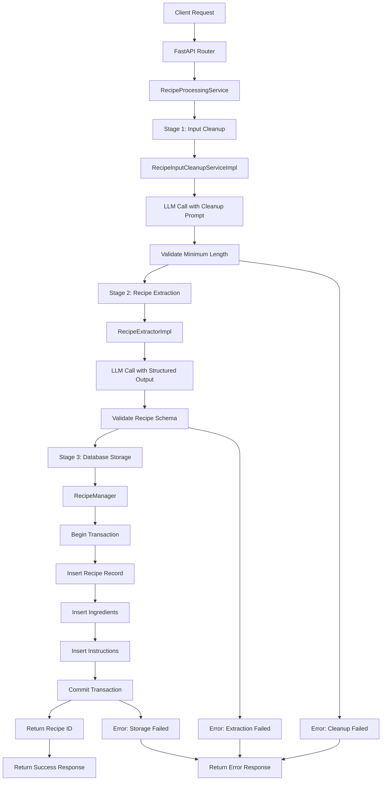

# Recipe Processing Flow Documentation

## Overview

The `process-and-store-recipe` endpoint provides a complete pipeline for converting raw, unstructured recipe text into structured data stored in the database. This endpoint is designed to handle messy input like scraped web content, HTML, or poorly formatted text.

## API Endpoint

**URL**: `POST /api/v1/process-and-store-recipe`

**Request Body**:
```json
{
  "raw_input": "string - raw unstructured recipe text"
}
```

**Response**:
```json
{
  "recipe_id": "uuid - database ID of stored recipe",
  "success": true,
  "message": "Recipe processed and stored successfully"
}
```

**Error Response**:
```json
{
  "error": "string - error description",
  "success": false
}
```

## Processing Pipeline

The endpoint orchestrates a three-stage pipeline through the `RecipeProcessingService`:

### Stage 1: Input Cleanup
**Service**: `RecipeInputCleanupServiceImpl`
**Location**: `app/services/recipe_input_cleanup_impl.py`

- **Purpose**: Clean messy input data (HTML, ads, navigation, etc.)
- **Method**: Uses LLM with cleanup-specific system prompt
- **Validation**: Ensures output has minimum 50 characters
- **Output**: Clean text containing only recipe-related content

### Stage 2: Recipe Extraction
**Service**: `RecipeExtractorImpl`
**Location**: `app/services/recipe_extractor_impl.py`

- **Purpose**: Extract structured recipe data from clean text
- **Method**: Uses LLM with structured output (Pydantic model validation)
- **Extracts**:
  - Title (string)
  - Ingredients (list of strings)
  - Instructions (list of strings)
  - Servings (optional string)
  - Total time (optional string)
- **Output**: Validated `Recipe` Pydantic model

### Stage 3: Database Storage
**Service**: `RecipeManager`
**Location**: `app/services/data/managers/recipe_manager.py`

- **Purpose**: Store structured recipe in database
- **Method**: `create_recipe_from_model()`
- **Database Operations**:
  1. Insert main recipe record (`recipes` table)
  2. Insert ingredients with order indices (`recipe_ingredients` table)
  3. Insert instructions with step numbers (`recipe_instructions` table)
- **Transaction**: Uses database transactions for atomicity
- **Output**: Recipe UUID

## Database Schema

### recipes
- `id` (UUID, Primary Key)
- `title` (VARCHAR)
- `servings` (VARCHAR, Optional)
- `total_time` (VARCHAR, Optional)
- `source_url` (VARCHAR, Optional)
- `created_at` (TIMESTAMP)
- `updated_at` (TIMESTAMP)

### recipe_ingredients
- `id` (UUID, Primary Key)
- `recipe_id` (UUID, Foreign Key → recipes.id)
- `ingredient_text` (TEXT)
- `order_index` (INTEGER)

### recipe_instructions
- `id` (UUID, Primary Key)
- `recipe_id` (UUID, Foreign Key → recipes.id)
- `instruction_text` (TEXT)
- `step_number` (INTEGER)

## Error Handling

The pipeline implements comprehensive error handling:

1. **Input Validation**: Empty or whitespace-only input rejected
2. **Cleanup Validation**: LLM output must meet minimum length requirements
3. **Extraction Validation**: Structured output must conform to Recipe schema
4. **Database Transactions**: Rollback on any storage failure
5. **Exception Handling**: All stages wrapped in try-catch blocks

## Flow Diagram



## Usage Example

```bash
curl -X POST "http://localhost:8000/api/v1/process-and-store-recipe" \
  -H "Content-Type: application/json" \
  -d '{
    "raw_input": "Chocolate Chip Cookies\n\nIngredients:\n- 2 cups flour\n- 1 cup sugar\n- 1/2 cup butter\n- 1 cup chocolate chips\n\nInstructions:\n1. Mix flour and sugar\n2. Add butter\n3. Fold in chocolate chips\n4. Bake at 350F for 12 minutes"
  }'
```

## Dependencies

- **LLM Service**: Text generation and structured output
- **Database**: PostgreSQL with psycopg2
- **Validation**: Pydantic models
- **Logging**: Python logging module
- **UUID Generation**: Python uuid module